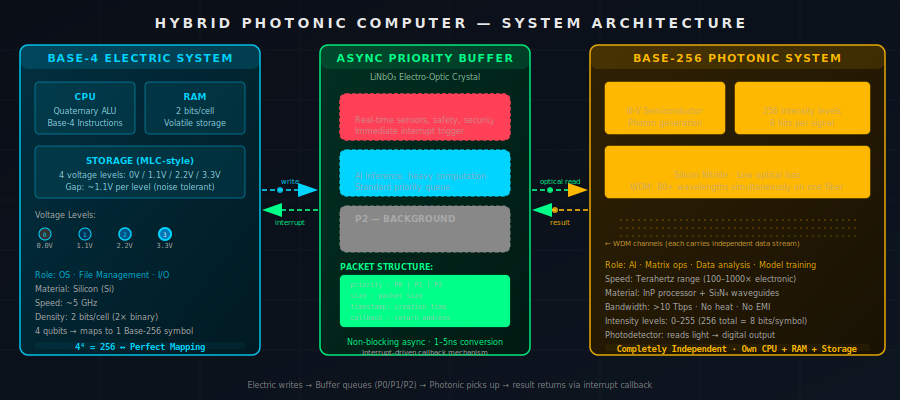
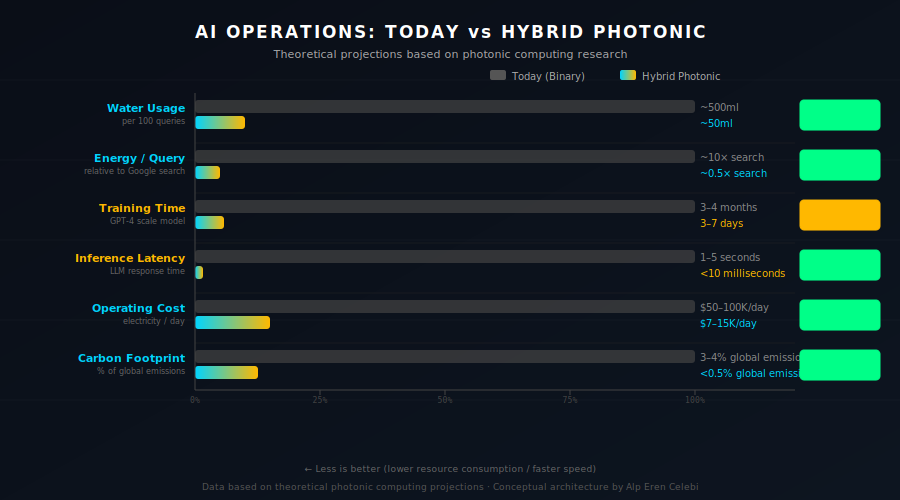

# Hybrid Photonic Computer Architecture

> A next-generation theoretical computer architecture combining **Base-4 electrical storage** with **Base-256 photonic processing** via an asynchronous priority queue buffer — designed to make AI computation 100–1000× faster while consuming 85–90% less energy and water.



---

## The Core Idea

Modern computers are fundamentally constrained by binary (Base-2) logic and copper-wire electrical signals. This architecture proposes breaking that constraint with two independent, purpose-built systems:

| System | Medium | Number Base | Role |
|--------|--------|-------------|------|
| Electric | Electricity (Si) | Base-4 | OS, storage, I/O, everyday tasks |
| Photonic | Light (InP + Si₃N₄) | Base-256 | AI, matrix ops, heavy computation |
| Buffer | LiNbO₃ crystal | — | Async bridge between both systems |

### The Mathematical Foundation

```
4⁴ = 256
```

Four Base-4 digits map **perfectly** to one Base-256 photonic symbol — zero conversion overhead. This is not an accident; it is the architectural foundation that makes the bridge between the two systems mathematically lossless.

---

## System 1 — Base-4 Electric Computer

```
Voltage Levels:
  ●  Level 0  =  0.0 V   (no signal)
  ●  Level 1  =  1.1 V   (low)
  ●  Level 2  =  2.2 V   (medium)
  ●  Level 3  =  3.3 V   (high)

Gap between levels: ~1.1 V
→ Highly noise-tolerant (similar margin to today's MLC SSD)

Information density: 2 bits per cell  (vs. 1 bit/cell in binary)
```

**Material:** Silicon (Si) — proven, mature, CMOS-compatible
**Role:** Operating system, file management, user I/O, everyday computing
**Speed:** ~5 GHz (same order as today's CPUs)
**Advantage:** 2× storage density over binary with the same fabrication process

---

## System 2 — Base-256 Photonic Computer

```
Light Intensity Levels: 0 – 255  (256 total)
→ Each signal carries 8 bits of information

Components:
  Laser source      →  III-V semiconductor, generates photons
  Optical modulator →  Encodes data as 256 intensity levels
  Waveguides        →  Si₃N₄, routes light (replaces copper wires)
  Photodetector     →  Reads light intensity → digital output
```

**Materials:**
- Processor: Indium Phosphide (InP) — efficient photon emission & detection
- Waveguides: Silicon Nitride (Si₃N₄) — ultra-low optical loss, CMOS-compatible
- Laser: III-V semiconductors — direct bandgap, efficient light emission

**Speed:** Terahertz range (100–1000× faster than electronic)
**Bandwidth:** >10 Tbps
**Key advantage:** Light produces **no heat** and is **immune to electromagnetic interference**

**WDM (Wavelength Division Multiplexing):** 80+ independent wavelengths can travel simultaneously on a single waveguide, multiplying effective bandwidth without additional hardware.

---

## The Async Priority Queue Buffer

```
                  ┌─────────────────────────┐
  BASE-4          │   LiNbO₃ BUFFER         │          BASE-256
  ELECTRIC  ─────►│                         │────────►  PHOTONIC
  SYSTEM    write │  ┌──────────────────┐   │  optical  SYSTEM
            ◄─────│  │ P0 — CRITICAL    │   │◄────────
            intr. │  │ P1 — NORMAL      │   │  result
                  │  │ P2 — BACKGROUND  │   │
                  │  └──────────────────┘   │
                  └─────────────────────────┘
```

**Material:** Lithium Niobate (LiNbO₃) — an electro-optic crystal that changes its optical properties when voltage is applied. The electric system writes via voltage; the photonic system reads optically.

### Priority Levels

| Level | Name | Use Case | Behavior |
|-------|------|----------|----------|
| P0 | Critical | Real-time sensors, safety, security | Immediate interrupt |
| P1 | Normal | AI inference, heavy computation | Standard queue |
| P2 | Background | Optimization, batch jobs, learning | Low-priority, non-blocking |

### Packet Structure

```
{
  priority  : P0 | P1 | P2
  size      : packet_size_bytes
  timestamp : creation_time_ns
  callback  : return_address
}
```

### Why Async?

- The electric system **writes to the buffer and immediately continues working** — it never blocks
- The photonic system **picks up the highest-priority job when available** — it never idles waiting
- Results return via **interrupt + callback** mechanism
- Neither system is ever a bottleneck for the other
- **Buffer latency:** ~1–5 ns at the electro-optic conversion boundary

---

## Materials Summary

| Component | Material | Reason |
|-----------|----------|--------|
| Async Buffer | Lithium Niobate (LiNbO₃) | Changes optical properties with applied voltage |
| Photonic processor | Indium Phosphide (InP) | Efficient photon emission and detection |
| Waveguides | Silicon Nitride (Si₃N₄) | Low optical loss, CMOS-compatible |
| Laser source | III-V Semiconductors | Direct bandgap, efficient light emission |
| Electric system | Silicon (Si) | Proven 70+ year technology |

---

## AI Impact



| Metric | Today (Binary) | Hybrid Photonic | Improvement |
|--------|---------------|-----------------|-------------|
| Water / 100 queries | ~500 ml | ~50 ml | **90% less** |
| Energy per query | ~10× a Google search | ~0.5× a Google search | **95% less** |
| GPT-4 scale training | 3–4 months | 3–7 days | **15–30× faster** |
| Inference latency | 1–5 seconds | <10 milliseconds | **98% faster** |
| Operating cost | $50–100K/day electricity | $7–15K/day | **85% less** |
| Carbon footprint | 3–4% of global emissions | <0.5% | **85% less** |

### Why These Numbers Matter

- **Water:** Data centers use millions of liters daily for cooling. Photonics generate no heat → cooling nearly eliminated.
- **Energy:** A ChatGPT query consumes ~10× the energy of a Google search. Photonic matrix multiplication is ~100× more efficient.
- **Training:** GPT-4 took months with thousands of GPUs. Photonic parallel processing + WDM could compress that to days.
- **Latency:** Current 1–5 s LLM response times become <10 ms with photonic processing.
- **Carbon:** The AI sector accounts for 3–4% of global carbon emissions. Photonics could reduce that below 0.5%.

---

## Full Comparison: Today vs Hybrid

| Feature | Today (Binary) | Hybrid Photonic | Status |
|---------|---------------|-----------------|--------|
| Number system | Base-2 (0, 1) | Base-4 + Base-256 | ⬆ Better |
| Bits per storage cell | 1 bit | 2 bits | ⬆ 2× |
| Bits per signal | 1 bit | 8 bits | ⬆ 8× |
| Processing speed | ~5 GHz | ~THz | ⬆ 100–1000× |
| Processing medium | Electricity (copper) | Photons (light) | ⬆ Better |
| Energy consumption | High (heat problem) | Very low (no heat) | ⬆ Better |
| EMI resistance | Medium | Very high | ⬆ Better |
| Bandwidth | ~100 Gbps | >10 Tbps | ⬆ 100× |
| Scalability | Near physical limits | Very high potential | ⬆ Better |
| Water usage (AI) | ~500 ml/100 queries | ~50 ml/100 queries | ⬆ 90% less |
| Manufacturing | Mature (70+ years) | Very difficult | ⬇ Harder |
| Software compatibility | All existing software | New compilers needed | ⬇ New ecosystem |
| Cost | Low (mass production) | Very high (initially) | ⬇ Expensive |
| Talent pool | Abundant | Very niche | ⬇ Scarce |

---

## Advantages

1. **100–1000× faster processing** — photonic signals travel at the speed of light through waveguides
2. **~90% less water consumption** — no heat generation means no cooling infrastructure
3. **~85% energy savings** — light produces no resistive heat loss
4. **Independent scaling** — async architecture allows each system to scale separately
5. **15–30× faster AI training** — months compressed to days via WDM parallel processing
6. **Fault isolation** — if one system crashes, the other continues unaffected
7. **EMI immunity** — photons are unaffected by electromagnetic interference
8. **Mathematical harmony** — 4⁴ = 256 provides lossless conversion between the two systems

## Disadvantages

1. **Manufacturing complexity** — two fundamentally different technologies must integrate at the chip level
2. **Very high initial cost** — photonic components are not yet mass-produced
3. **Software ecosystem from scratch** — new compilers, operating systems, and toolchains required
4. **Optical memory limitation** — photons cannot be easily stopped; persistent optical storage is an unsolved problem
5. **Buffer latency** — ~1–5 ns electro-optic conversion overhead at the boundary
6. **Talent shortage** — photonic engineering is an extremely niche field

---

## Project Structure

```
hybrid-photonic-computer/
├── index.html                      # Interactive visualization (self-contained)
├── README.md                       # This file
└── assets/
    ├── architecture-diagram.svg    # System architecture diagram
    ├── ai-impact-comparison.svg    # AI performance comparison chart
    └── computer-3d-concept.svg     # Isometric 3D concept render
```

---

## Run Locally

No build step, no dependencies, no server required.

```bash
# Clone the repository
git clone https://github.com/yourusername/hybrid-photonic-computer.git
cd hybrid-photonic-computer

# Open the interactive visualization
# On Windows:
start index.html
# On macOS:
open index.html
# On Linux:
xdg-open index.html
```

The `index.html` file is fully self-contained and works on the `file://` protocol. All animations use the Canvas 2D API — no WebGL, no external libraries.

---

## Conceptual Status

This is a **theoretical architecture** — it does not yet exist as physical hardware. All numbers are theoretical projections based on current photonic computing research. The architecture is grounded in real physics and engineering principles:

- Base-4 voltage levels are analogous to existing MLC/TLC NAND flash technology
- Photonic computing research (MIT, Intel, IBM) has demonstrated components at lab scale
- LiNbO₃ electro-optic modulators are commercially available today
- WDM is production technology in fiber optic networks

The primary barriers are integration complexity and manufacturing cost, not fundamental physics.

---

## Creator

This architecture was designed by **Alp Eren Celebi** through iterative exploration of fundamental computer science questions starting from: *"What if computers used more than just 0 and 1?"*

The design path:

```
Binary → Base-4 → Base-16 → Optimal base analysis
       → Photonic computing discovery
       → Hybrid architecture decision
       → Async vs sync communication analysis
       → Priority queue design
       → Complete system specification
```

---

## License

This project is released under the [MIT License](LICENSE).

The architecture concept, diagrams, and interactive visualization were created by Alp Eren Celebi.
